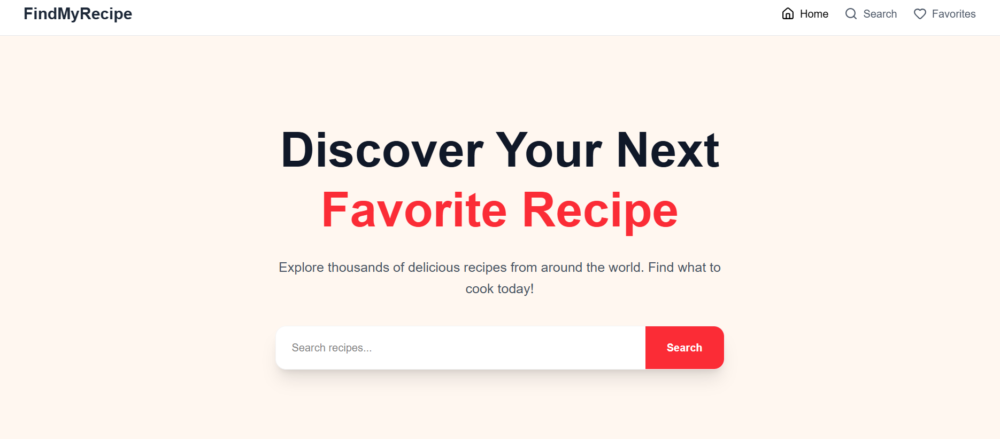
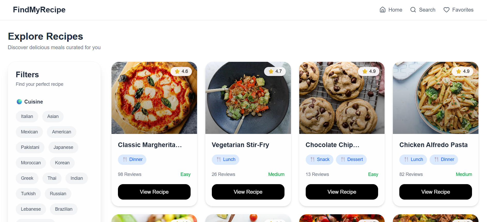
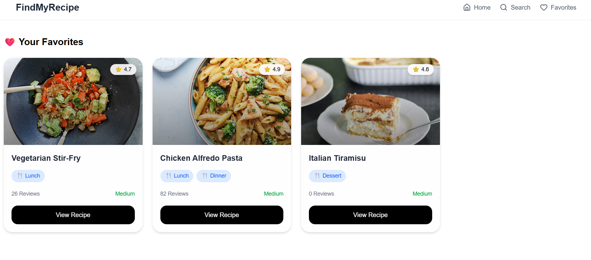

# FindMyRecipe

A modern recipe discovery platform that helps users explore recipes, search meals, browse categories, apply advanced filters, and save favorite dishes for quick access.

## Live Demo

https://find-my-recipe.vercel.app

---

## Features

* Browse recipes across multiple categories
* Search recipes by name
* Filter recipes by cuisine, difficulty, meal type, calories, and ratings
* View detailed recipe information
* Save and manage favorite recipes
* Trending recipes section
* Responsive design for all screen sizes

---

## Screenshots

### Home Page



### Recipes Page



### Favorites Page



## Getting Started

```bash
git clone https://github.com/Abhavya28/find-my-recipe.git

cd find-my-recipe

npm install

npm run dev
```
---

## Key Features

### Recipe Discovery

Explore a curated collection of recipes with detailed information and ratings.

### Advanced Filtering

Filter recipes by cuisine, meal type, difficulty level, calorie range, and ratings to quickly find the perfect meal.

### Favorites Management

Save recipes to a favorites collection for easy access later.

### Search Experience

Search recipes instantly with an intuitive and user friendly interface.

